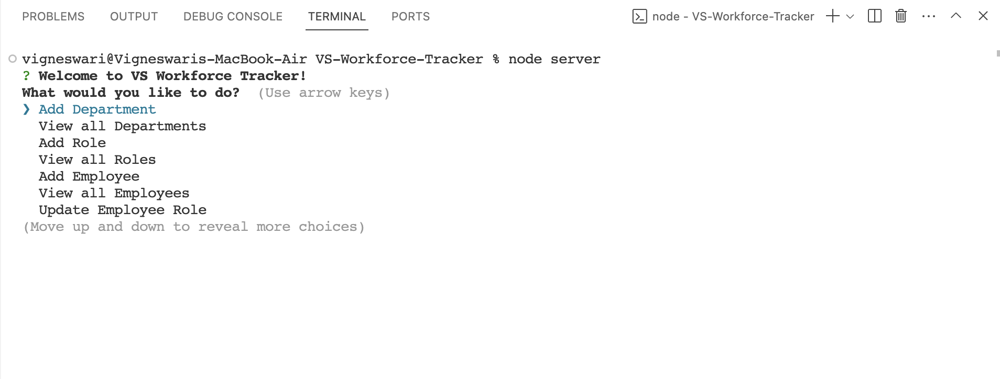
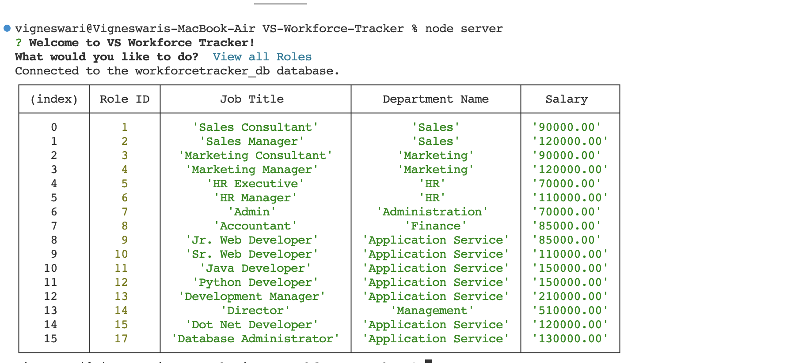
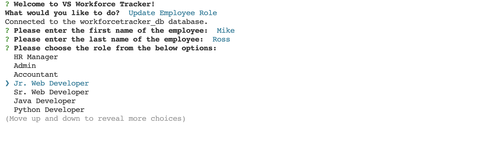
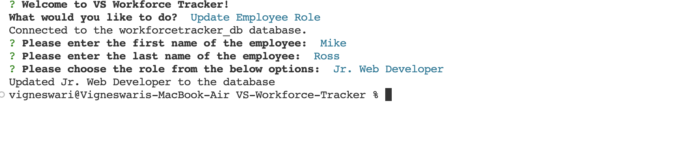
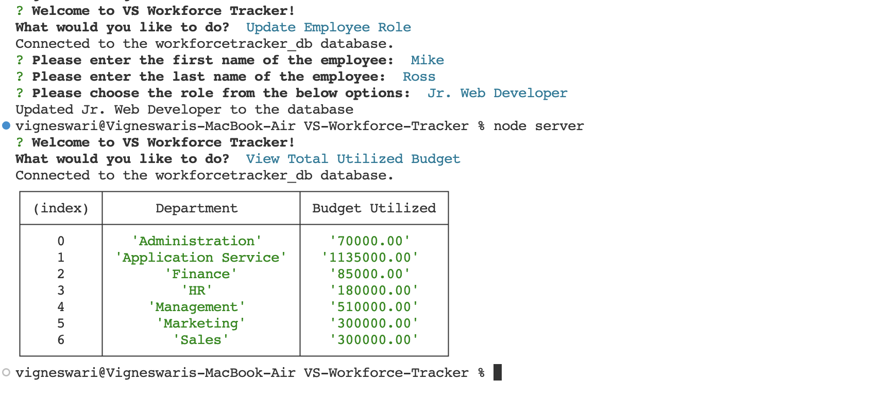

# VS-Workforce-Tracker

## Description

VS-Workforce-Tracker is a simple server-side application that allows small business owners to manage their employees easily. It will enable them to define departments and various roles for the workforce. It accepts user inputs from the command line prompts and responds with action based on user request. The application uses server-side technologies like Node.js, Inquirer, and Mysql packages to accept inputs, process data in the database, and run as a command-line application.

## Installation

To run or execute the application, one must have node installed in the system and other supporting packages like inquirer.js

Follow the guidelines using the link to install Node.js: https://nodejs.org/en/learn/getting-started/how-to-install-nodejs, 

Follow the guidelines using the link to install inquirer.js: https://www.npmjs.com/package/inquirer/v/8.2.4

Follow the guidelines using the link to install mysql: https://www.npmjs.com/package/mysql

## Usage

The application source code can be accessed using the link https://github.com/Vigneshwarie/VS-Workforce-Tracker

One can download the code from the above link. To use this application, one must install all node.js, inquirer.js, and MySQL, as mentioned in the installation section. Then, navigate to the db folder and execute the schema and seeds SQL file to create the base database structure for the application to run. Also, before running the application, please ensure that you update your MySQL database credentials for the database in the server.js file.

Once completed, navigate to the application folder and run the server.js file in the integrated terminal of vscode. Use the command below to the file,

application-folder> node server.js

On successful installation and execution, the application will prompt the user with questions to manage the database as below.

## Walkthrough Video

## Credits

N/A

## License

Please refer to the LICENSE in the repo.
